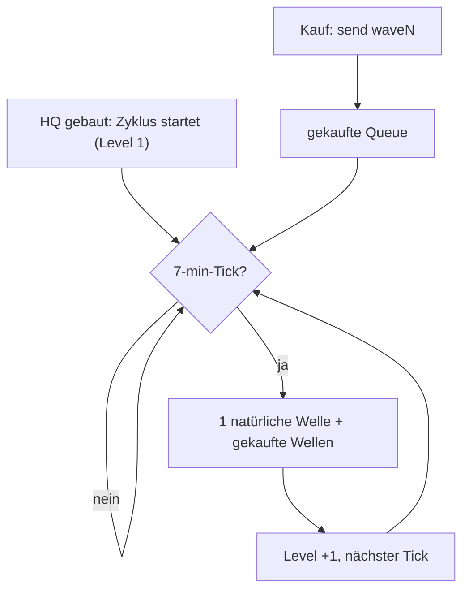

# Rift Breaker Battle Mod

[](https://github.com/momokli/riftbreaker-battle-mod/actions/workflows/ci.yml)
[](https://github.com/momokli/riftbreaker-battle-mod/actions/workflows/lint.yml)
[](https://github.com/momokli/riftbreaker-battle-mod/releases)
[](https://github.com/momokli/riftbreaker-battle-mod/issues)

Ein **Biter-Battles-artiger Runden-Duell-Modus** für _The Rift Breaker_ (EXOR Studios).

## Ziel

Runden-Duell 1v1: Beide Spieler spielen eine eigene Rift-Breaker-Partie. Pro Runde Punkte ansparen (Ressourcen, Kills), um damit **Kreaturen-Wellen zum Gegner zu schicken** oder die **eigene Defense auszubauen**. Gewonnen hat, wer die gegnerische Basis zerstört — oder am Ende die meisten Punkte hat.

## Spielschleife (Core Loop)

Der Kern des Mods ist ein fester **Angriffszyklus**:

1. **HQ gebaut** → die Runde startet (Level 1).
2. **Alle 7 Minuten** feuert genau **eine natürliche Welle** — das Level eskaliert von 1 bis 9.
3. **Kaufen für die nächste Angriffswelle:** Spieler kaufen zusätzliche Wellen (Carbonium, sofort abgezogen). Die stapeln sich in einer Queue und feuern beim nächsten Tick **gemeinsam** mit der natürlichen Welle.



Details & Preistabelle: [docs/CORE_LOOP.md](docs/CORE_LOOP.md) · Code: [`deploy/attack-cycle/attack_cycle.py`](deploy/attack-cycle/attack_cycle.py)

## Aktueller Stand

Der Operator-Zugang läuft über das Cockpit
[cockpit.rift.projectmellon.de/contract/](https://cockpit.rift.projectmellon.de/contract/)
(prod) bzw. [cockpit.drift.projectmellon.de/contract/](https://cockpit.drift.projectmellon.de/contract/)
(dev). Die Spiellogik liegt im Backend (rbbridge.dll C++ + Cockpit als manueller
Operator); der Lua-Mod ist nur die Player-HUD-Schicht. Rust-Backend/Referee = **1.1**.

## Komponenten (1.0)

| Komponente            | Ort                             | Aufgabe                                             |
| --------------------- | ------------------------------- | --------------------------------------------------- |
| **Client-Mod (Lua)**  | `client-mod/`                   | HUD-/Display-Schicht, **keine** Business-Logik      |
| **Server (rbbridge)** | `server/`                       | native C++ Read/Write: DLL + HTTP-Bridge + Injector |
| **Cockpit**           | `cockpit/`                      | manueller Operator (1.0-Backend)                    |
| **Deploy/CI**         | `deploy/`, `.github/workflows/` | Dedi-Setup, Caddy, Pipeline                         |
| **Rust-Backend**      | `tournament/`                   | autoritativer Referee (**1.1**)                     |

Details: [docs/1.0-COMPONENTS.md](docs/1.0-COMPONENTS.md) · Priority: [docs/1.0-PRIORITY.md](docs/1.0-PRIORITY.md)

## Verteilung

- `client-mod/` = Workshop-tauglicher Lua-Mod (nur HUD).
- `server/` = **private Distribution** (Server-Anteil, nie Workshop).
- `scripts/package_mod.sh` packt `client-mod/` → `dist/`.
- `docs/workshop.md` = Steam-Workshop-Anleitung (AppID 780310, SteamCMD).

## Repo-Struktur

```
riftbreaker-battle-mod/
├── client-mod/  # Lua-PLAYERMOD (nur HUD)
├── server/      # SERVERMOD: rbbridge.dll + pipe_bridge + injector
├── cockpit/     # Web-UI Cockpit (manueller Operator)
├── tournament/  # Rust-Referee (1.1)
├── deploy/      # Ansible/Docker/Caddy (Dedi-Setup + CI)
├── docs/        # Konzept, Findings, Playtest, Komponenten/Priority
├── scripts/     # Build-/Package-Tooling
├── tools/       # RE, server-control, session-recorder, deploy-gate, …
└── tests/       # Host-/Unit-Tests
```

## Mitmachen

Beiträge willkommen! Workflow, Claim-System (`!claim` im Issue-Kommentar) und
Quality-Gates stehen in [CONTRIBUTING.md](CONTRIBUTING.md); den Projektfortschritt
zeigt [docs/PROGRESS.md](docs/PROGRESS.md).
