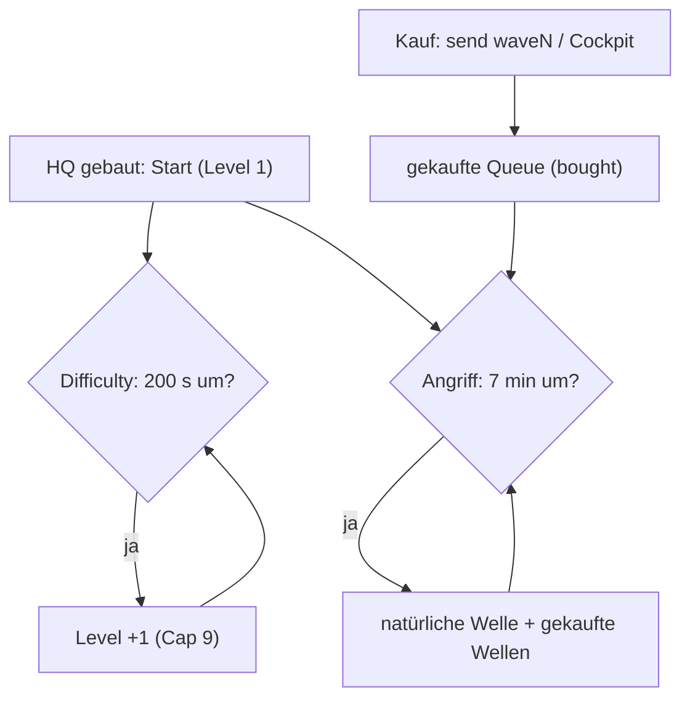

# Core Loop — der Angriffszyklus (v1.0.0)

Der zentrale Spiel-Mechanismus des Mods. Hier passiert die „Action": Spieler
**kaufen Wellen**, die beim nächsten Angriff einschlagen.

## Das Grundprinzip

1. **Runde startet, sobald das HQ gebaut ist** (`hq_hp > 0`). Der Zyklus beginnt
   bei Level 1.
2. **Difficulty (eigener Timer, #778):** alle 200 Sekunden (Default
   `difficulty_interval = 200 s`) steigt das Wellen-Level um 1 (1 → 9, Deckel 9) —
   rein zeitbasiert, unabhängig davon, ob gerade eine Welle feuert.
3. **Angriff (eigener Timer):** alle 7 Minuten (Default `interval = 420 s`) feuert
   eine natürliche Welle auf dem aktuellen Difficulty-Level.
4. **Kaufen für die nächste Angriffswelle:** Spieler kaufen Wellen (Carbonium,
   sofort abgezogen). Gekaufte Wellen stapeln sich in einer Queue und feuern beim
   nächsten Angriff **gemeinsam** mit der natürlichen Welle — erst die Naturwelle,
   dann die gekauften, nacheinander.

## Kaufen → Feuern (Ablauf)

1. **Kauf** (`-send waveN` bzw. Cockpit-Button) → `POST /queue_send` → die Order
   wird **sofort** in die Order-Liste eingereiht (kein Blockieren des HTTP-Handlers).
2. **Bezahlen** läuft im Hintergrund (`/try_spend`): nur wenn das Carbonium reicht,
   wandert die Welle in die `bought`-Queue; sonst wird die Order verworfen
   (kein Optimistic-Spawn).
3. **Angriff** (alle 7 min): `activate_mission_flow` feuert die Naturwelle auf dem
   aktuellen Difficulty-Level, danach alle gekauften Wellen nacheinander.

## Preise (Carbonium)

| Level |   1 |   2 |    3 |    4 |    5 |    6 |    7 |    8 |     9 |
| ----: | --: | --: | ---: | ---: | ---: | ---: | ---: | ---: | ----: |
|  Cost | 300 | 700 | 1400 | 2450 | 4000 | 5350 | 7600 | 9650 | 10500 |

## Wellen-Spawn (Logic-Pfade)

Alle Wellen feuern über `POST /activate_mission_flow` mit
`logic/missions/survival/attack_level_N_id_1.logic` (raw spawn, sofort). Level 9
teilt den Pool mit Level 8 (#658).

- `_id_1` = **raw spawn** (sofort) — Standard im Core Loop.
- `_entry` = hat einen harten „attack incoming“-Delay — bewusst **nicht** im Core Loop.
- `logic/dom/*` = löst nur „attack incoming“ aus, **ohne** Spawn.

## Wo das läuft (Sidecar)

Der Core Loop ist ein **eigener Server-Sidecar** — nicht in der Web-UI und nicht in
der DLL:

- Code: `deploy/attack-cycle/attack_cycle.py` (Zustandsmaschine `AttackCycle`).
- Tests: `deploy/attack-cycle/test_attack_cycle.py`
  (`python3 -m unittest test_attack_cycle -v`).
- Endpunkte: `GET /status`, `POST /queue_send`.
- Grundriss: `deploy/attack-cycle/README.md`.
