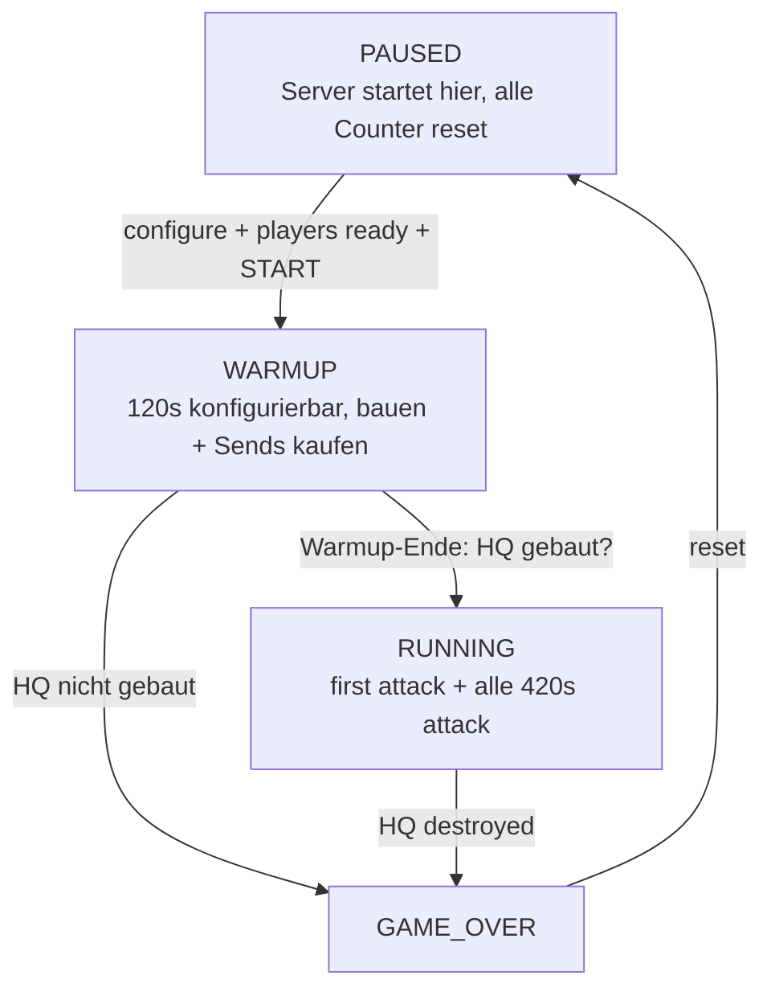

# Game Flow — Zustandsmaschine + Ein-Code-Prinzip (Spec)

**Status:** Arbeits-Spec (Design) · **Stand:** 2026-09-21
**Kontext:** Attack-Cycle (`deploy/attack-cycle/`) · Referee-Zielbild (1.1, `tournament/`) · Issue #823

## 1. Ein-Code-Prinzip (tragend)

Es gibt **eine** Game-Flow-Logik. Der Referee unterscheidet zwei Modi — **VS**
(2 Welten) und **SOLO** (1 Welt) — handelt aber **im Kern identisch**. Der einzige
Unterschied ist die **Send-Senke** (wohin ein gekaufter Send geht):

| Modus | Welten | Gegner            | Send-Senke                        |
| ----- | ------ | ----------------- | --------------------------------- |
| SOLO  | 1      | Persona (emuliert) | an sich selbst / ins Leere        |
| VS    | 2      | echter 2. Server   | an Server B                       |

**SOLO ist Dev-Work.** Es ist das Test-/Experimentier-Bett, um dieselbe Logik ohne
zweiten Server zu bauen und zu validieren — **nicht** das Zielprodukt. Die **Persona
emuliert den VS-Gegner**: sie ist der Platzhalter für Server B, bis der 1v1-Referee
existiert. `send_yourself off` ist die **Nahtstelle, wo Server B einrastet** — im VS
wird aus „ins Leere" einfach „an Welt B". Nichts an State-Machine, Wellen oder
Difficulty ändert sich dabei.

**Konsequenz für die Umsetzung:** State-Machine, Wellen-Feuer, Difficulty, Sends —
**modus-unabhängig** geschrieben, „Welt" als Parameter (`world_count` 1 vs. 2,
„world-getaggt", vgl. #361). Keine Solo/1v1-Duplikation. Die 1.1-Rust-Fassung
(`tournament/`) faltet exakt diese Logik ein; `attack_cycle.py` ist der Vorläufer
desselben Codes.

## 2. Zustandsmaschine (Zielmodell)



Text-Fassung:

```text
[PAUSED]   Server startet hier: alle Counter reset, keine Timer
    │  configure (Web-UI: enemy behaviour, game rules, send_yourself, …)
    │  wait for all players ready
    │  START-Signal
    ▼
[WARMUP]   120 s (konfigurierbar): bauen + Sends kaufen
    │  Warmup-Ende
    │  ├─ HQ gebaut? ── nein ──> [GAME_OVER]
    │  └─ ja
    ▼
[RUNNING]  first attack (natural + enemy/self/persona sends, je "if enabled")
    │  alle 420 s next attack; difficulty 200 s (konfigurierbar) → dann 600 s
    │  HQ destroyed ──> [GAME_OVER]
    ▼
[GAME_OVER] ── reset ──> [PAUSED]
```

**Send-Quellen beim Attack** (je „if enabled"): `natural` (Natural Waves) +
`enemy`/`persona` (Gegner) + `self` (eigene Kaeufe). Im SOLO sind `enemy`/`persona`
der emulierte Gegner, `self` läuft über `send_yourself`. Im VS sind `enemy` die echten
Sends von Server B und `self` die eigenen, die zu B gehen.

## 3. Gap zum heutigen `attack_cycle.py`

| Heute | Ziel |
| ----- | ---- |
| `HQ gebaut` = Start-Trigger | **START-Signal** startet (HQ ist NICHT mehr Start-Trigger) |
| kein Paused | **PAUSED** = initialer Zustand (Server startet paused, Counter reset) |
| kein Warmup | **WARMUP** 120 s (konfigurierbar) vor dem ersten Attack |
| HQ-Tod nicht im attack_cycle (match-loop separat) | **HQ destroyed → GAME_OVER** (nach Warmup ist HQ nur noch Game-Over-Trigger) |
| nur `send_yourself`-Toggle | **„if enabled"-Toggles je Send-Quelle** (natural / enemy / self / persona) |
| Difficulty 200→600 (konfigurierbar via #800/#819) | 200 s (konfigurierbar) → 600 s (konfigurierbar) — unverändert |

## 4. Offene Fragen

1. Warmup-Dauer (120 s) — im Cockpit editierbar machen (analog `interval_s`)?
2. `START`-Signal: über die Bridge (`POST /start`) wie `attack_reset`?
3. `wait for all players ready`: Solo-1-Spieler-Ready, oder echtes Multi-Ready?
4. `GAME_OVER` → automatisch reset → PAUSED, oder manueller Rematch-Knopf?

## Refs

#823 (dieses Modell) · #819 (Natural-Attacks konfigurierbar) · #800 (Difficulty-Escalation) ·
#361 (Zwei-Welten-Mirror, world-getaggt) · #183/#185 (Match-Lifecycle/Runden-Phasen) ·
#167 (Setup-Phase) · #516/#519/#520 (Round-Reset/end_game/pause nativ) ·
`docs/DOM_REPLICA.md` · `docs/1.0-COMPONENTS.md` · `tournament/README.md`
