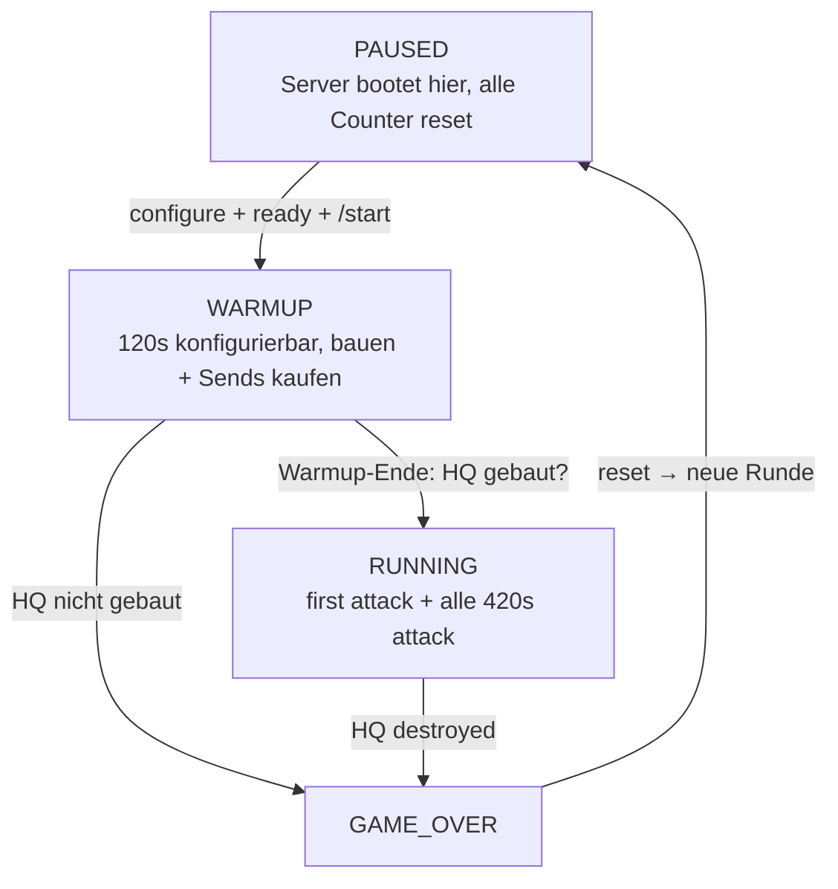

# Game Flow — Zustandsmaschine + Ein-Code-Prinzip (Spec)

**Status:** Arbeits-Spec (Design) · **Stand:** 2026-09-21
**Kontext:** Attack-Cycle (`deploy/attack-cycle/`) · Referee-Zielbild (1.1, `tournament/`) · Issue #823

## 1. Ein-Code-Prinzip (tragend)

Es gibt **eine** Game-Flow-Logik. Der Referee unterscheidet zwei Modi — **VS**
(2 Welten) und **SOLO** (1 Welt) — handelt aber **im Kern identisch**. Der einzige
Unterschied ist die **Send-Senke** (wohin ein gekaufter Send geht):

| Modus | Welten | Gegner             | Send-Senke                 |
| ----- | ------ | ------------------ | -------------------------- |
| SOLO  | 1      | Persona (emuliert) | an sich selbst / ins Leere |
| VS    | 2      | echter 2. Server   | an Server B                |

**SOLO ist Dev-Work.** Es ist das Test-/Experimentier-Bett, um dieselbe Logik ohne
zweiten Server zu bauen und zu validieren — **nicht** das Zielprodukt. Die **Persona
emuliert den VS-Gegner**: sie ist der Platzhalter für Server B, bis der 1v1-Referee
existiert. `send_enemy` ist die **Nahtstelle, wo Server B einrastet** — im VS wird aus
„an den (emulierten) Gegner" einfach „an Welt B". Nichts an State-Machine, Wellen oder
Difficulty ändert sich dabei.

**Konsequenz für die Umsetzung:** State-Machine, Wellen-Feuer, Difficulty, Sends —
**modus-unabhängig** geschrieben, „Welt" als Parameter (`world_count` 1 vs. 2,
„world-getaggt", vgl. #361). Keine Solo/1v1-Duplikation. Die 1.1-Rust-Fassung
(`tournament/`) faltet exakt diese Logik ein; `attack_cycle.py` ist der Vorläufer
desselben Codes.

## 2. Zustandsmaschine (Zielmodell)



```text
[PAUSED]   Server bootet hier: alle Counter reset, keine Timer
    │  configure (Web-UI: mode, warmup, natural/persona/self/enemy, …)
    │  wait for all players ready (Cockpit-Klick, später /ready im Chat)
    │  /start-Signal (Referee → beide Server im VS, nur A im SOLO)
    ▼
[WARMUP]   120 s (konfigurierbar): bauen + Sends kaufen — läuft IMMER voll
    │  Warmup-Ende
    │  ├─ HQ gebaut? ── nein ──> [GAME_OVER]
    │  └─ ja
    ▼
[RUNNING]  first attack (natural + enemy/self/persona, je "if enabled")
    │  alle 420 s next attack; difficulty 200 s (konfigurierbar) → dann 600 s
    │  HQ destroyed ──> [GAME_OVER]  (sofort, keine Gnadenfrist)
    ▼
[GAME_OVER] ── reset → neue Runde ──> [PAUSED]
```

## 3. Send-Quellen & Toggles

Vier unabhängige ON/OFF-Toggles, die die Attack-Zusammensetzung steuern:

| Toggle    | Bedeutung                                               |
| --------- | ------------------------------------------------------- |
| `natural` | Natural Waves feuern?                                   |
| `persona` | Persona (emulierter Gegner) feuert?                     |
| `self`    | eigene Kaeufe an sich selbst feuern? (`send_yourself`)  |
| `enemy`   | eigene Kaeufe ZUSAETZLICH an den Gegner? (`send_enemy`) |

**Default je Modus** (per ENV beim START), danach in der Web-UI frei anpassbar —
z. B. `self` im VS anmachen = der eigene Send geht an sich selbst UND an den Gegner.

**Buy-/Send-Semantik:**

- `buy` wird **immer** ausgelöst, wenn möglich (Carbonium reicht) — und **immer** getrackt, was gekauft wurde.
- `send_yourself` (self): ob die gekauften Waves an sich selbst gehen.
- `send_enemy` (enemy): ob sie **zusätzlich** an den Gegner gehen.
- Beide können **gleichzeitig** an sein (Send an sich selbst UND an den Gegner).

Im SOLO ist `enemy`/`persona` der emulierte Gegner; im VS ist `enemy` der echte
Server B und `persona` entfällt (bzw. bleibt aus).

## 4. Konfiguration

`mode` (VS/SOLO), Warmup-Dauer, die vier Toggles, Difficulty-/Natural-Attack-Rules
(vgl. #819): **ENV für den Default beim START**, in der **Web-UI anpassbar**.

## 5. Gap zum heutigen `attack_cycle.py`

| Heute                                             | Ziel                                                                       |
| ------------------------------------------------- | -------------------------------------------------------------------------- |
| `HQ gebaut` = Start-Trigger                       | **`/start`-Signal** startet (HQ ist NICHT mehr Start-Trigger)              |
| kein Paused                                       | **PAUSED** = Boot-Zustand (Server bootet paused, Counter reset)            |
| kein Warmup                                       | **WARMUP** 120 s (konfigurierbar), läuft immer voll                        |
| HQ-Tod nicht im attack_cycle (match-loop separat) | **HQ destroyed → GAME_OVER** (sofort, keine Gnadenfrist)                   |
| nur `send_yourself` (on/off)                      | **4 Toggles** natural/persona/self/enemy + `send_enemy` als eigener Toggle |
| Difficulty 200→600 (konfigurierbar via #800/#819) | 200 s (konfigurierbar) → 600 s (konfigurierbar) — unverändert              |

## 6. Entscheidungen (Interview, 2026-09-21)

1. **Modus (A1):** Konfig in der Web-UI; ENV für den Default beim START, in der Web-UI anpassbar.
2. **VS vs SOLO (A2):** sonst nichts anders (erstmal) — nur die Send-Senke.
3. **Warmup (B1):** editierbar, ENV-Default + Web-UI.
4. **START (B2):** Server bootet PAUSED; Referee sendet `/start` an beide Server (VS) bzw. nur A (SOLO).
5. **Ready (B3):** erstmal Cockpit-Klick, später `/ready` im Chat.
6. **GAME_OVER (B4):** automatisch reset → neue Runde.
7. **Toggles (C1):** natural/persona/self/enemy je ON/OFF, Default je Modus, dann anpassbar.
8. **Send-Semantik (C2):** buy immer (wenn möglich) + immer tracken; `send_yourself` (self) und `send_enemy` (enemy) sind zwei getrennte Toggles, beide können an sein.
9. **Warmup läuft voll (D1):** ja, immer 120 s.
10. **HQ destroyed (D2):** sofort vorbei, keine Gnadenfrist.

## Refs

#823 (dieses Modell) · #819 (Natural-Attacks konfigurierbar) · #800 (Difficulty-Escalation) ·
#361 (Zwei-Welten-Mirror, world-getaggt) · #183/#185 (Match-Lifecycle/Runden-Phasen) ·
#167 (Setup-Phase) · #516/#519/#520 (Round-Reset/end_game/pause nativ) ·
`docs/DOM_REPLICA.md` · `docs/1.0-COMPONENTS.md` · `tournament/README.md`
