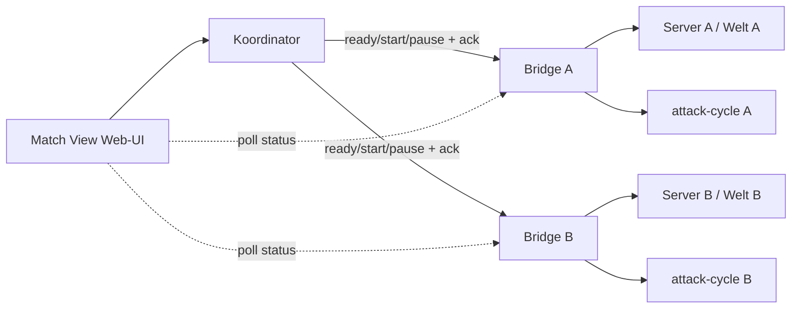
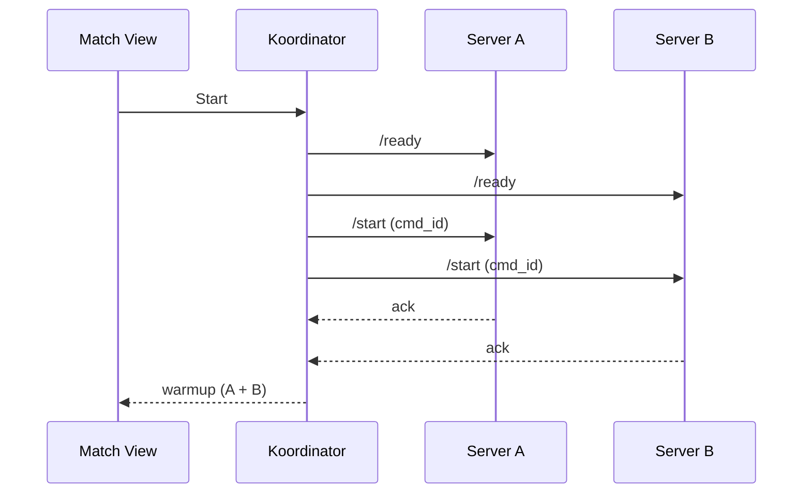

# Match View — UI + Struktur/Architektur (1v1/Solo)

**Status:** final · **Stand:** 2026-10-05 · **Issue:** #1031 (Design #873)
**Kontext:** Base-Game-Sicht für ein Match. Ref: [`GAME_FLOW.md`](GAME_FLOW.md),
[`CORE_LOOP.md`](CORE_LOOP.md), [`1.0-COMPONENTS.md`](1.0-COMPONENTS.md),
[`cockpit/README.md`](../cockpit/README.md).

> **Zweck dieses Dokuments:** UI und Struktur/Architektur festlegen, damit danach
> ein Wireframe-/Grafik-Prompt und die Umsetzungs-Issues darauf aufsetzen können.
>
> **Umsetzung (#1031):** Die Match-View ist als **read-only** Single-File-Seite
> `GET /match` im GNS-Relay umgesetzt (Cockpit-Stil). **Abweichung zur
> Komponentenliste des Issues:** nicht `site/`, sondern embedded im Proxy —
> Begruendung §12 (site/ = Landing ohne Auth). Details/Ist-Stand: §6, §11–§13.

## 1. Abgrenzung: Cockpit vs. Match View

| | **Cockpit** (bleibt) | **Match View** (neu) |
|---|---|---|
| Rolle | Operator / Config / Cheats / Explore | der Match-Bildschirm |
| Inhalt | Intervalle, Toggles, Persona-Editor (*definieren*), Advanced/Docker, Ressourcen-Cheats | pro Spielseite: Spieler, HQ, Attack-Cycle, Sends, Events |
| Charakter | Formulare, editierbar | **read-mostly** + wenige globale Aktionen |
| Nutzer | Operator (Momo/Matheo) | Spieler/Operator im laufenden Match |

Die Match View ersetzt **nicht** das Cockpit. Einstellungen bleiben im Cockpit;
die Match View **zeigt** den Match und erlaubt nur wenige Eingriffe.

## 2. Modi (dieselbe View)

| Modus | Linke Seite | Rechte Seite |
|---|---|---|
| **SOLO** | Welt A (echter Spieler) | **Persona** (emulierter Gegner) |
| **VS** | Welt A (Server A) | Welt B (Server B) |

Die **Struktur ist identisch** — nur die Datenquelle der rechten Seite variiert
(Solo: Persona/Sidecar; VS: zweiter Server). Das ist bewusst so, damit die View
später „logisch" bleibt.

## 3. Arbeitstitel

„**Match View**" (alternativ „Game View"). Im UI: der Match-Bildschirm. Der
Bestandteil „Cockpit" meint weiterhin das Operator-Werkzeug.

## 4. Layout

Globaler Kopf + **zwei gleichwertige Seiten-Spalten** + Statusleiste. Das
Config-Panel ist **separat** (eigene Ansicht/Overlay), nicht im Match.

```text
┌──────────────────────────────────────────────────────────────────────────────┐
│  MATCH · MODE vs · Round 2 · Phase WARMUP 1:42 · Winner —                     │
│  [ Start ]   [ ‖ Pause ]   [ ↻ New Round ]                        ⚙ Config    │
├────────────────────────────────┬─────────────────────────────────────────────┤
│  WELT A  ·  momos               │  WELT B  ·  matheo                          │
│  players 1        🟢 running     │  players 1        🟢 running                 │
│  HQ 100/100  alive              │  HQ  68/100  alive                          │
│  ── Attack Cycle ──             │  ── Attack Cycle ──                         │
│  level 3    next +1 in 4:12     │  level 3    next +1 in 4:12                 │
│  next attack 2:07               │  next attack 2:07                           │
│  natural 3 · self 5,5           │  natural 3 · enemy 5,5                      │
│  ── Sends ──                    │  ── Sends ──                                │
│  queued 3,5,5   outgoing –      │  queued –     outgoing 5,5                  │
│  ── Server ──                   │  ── Server ──                               │
│  🟢 running · up 42m            │  🟢 running · up 42m                        │
│  ── Events ──                   │  ── Events ──                               │
│  12:00:12  wave 3  →            │  12:00:12  wave 3  ←                        │
│  12:00:05  send 5               │  12:00:06  HQ −32                           │
│  12:00:01  round start          │  12:00:01  round start                      │
└────────────────────────────────┴─────────────────────────────────────────────┘
[ status / fehler … ]                                                  [ 12:03 ]
```

**Responsiv:** ≥ 980 px zwei Spalten; darunter gestapelt (A oben, B unten), Kopf
und Statusleiste bleiben fix. Stil = wie das Cockpit (flaches Qt, 1px-Linien,
3px-Radius, `tabular-nums`, dunkel).

## 5. Globale Leiste (Kopf)

| Element | Inhalt | Aktion |
|---|---|---|
| Phase-Badge | `lobby` / `paused` / `warmup` / `running` / `game_over` / `ended` | — |
| Runde | z. B. „Round 2" | — |
| Winner | `—` / `A` / `B` | — |
| **Start** | gemeinsamer Start beider Seiten | atomarer Broadcast (siehe §10) |
| **Pause / Resume** | beide Seiten gleichzeitig einfrieren | `POST /pause_dom` + `/resume_dom` an **beide** Bridges (#871); der Referee stellt dafuer die match-weite Route `POST /pause` / `POST /resume` bereit (#997) |
| **New Round** | Reset + Map-Restart + Start (Wrapper) | siehe #854 |
| **Config** | öffnet das Config-Panel (§7) | Navigation |

## 6. Seiten-Spalte (pro Welt A | B)

| Block | Zeigt | Datenquelle (heute) |
|---|---|---|
| **Identität** | Spieler-Anzahl + **Namen** | `get_state.players` (Zahl ✅); Namen ⚠️ (§11.4) |
| **HQ** | `hp/max`, `alive/dead` | `get_state.hq_hp`, `hq_hp_max`, `hq_dead` ✅ |
| **Attack Cycle** | `state`, `level`, countdown `+1`/next attack, Warmup-Restzeit, nächste Wellen (natural/self/enemy) | `attack_status` ✅ |
| **Pause** | `dom_paused` (Direktor eingefroren) | `get_state.dom_paused` ✅ (#871) |
| **Sends** | `queued` (bought), `outgoing` | `attack_status.bought/outgoing` ✅ |
| **Server** | Container-`state`/`health`/`uptime` | `/server/status` ✅ |
| **Events** | strukturierte Match-Events dieser Seite | Event-Feed (§11.5) ⚠️/neu |

Warmup-Restzeit ist der wichtigste Wert während der Aufbauphase → prominent
(Abfolge nach #856: `attack_status.seconds_to_warmup_end`).

**Soll/Ist-Abgleich (#1031, 2026-10-05):** Die umgesetzte `GET /match`-View zeigt
(aus dem Referee-`/state`) je Seite `teams.<W>.player`, `ready`, `hq_hp`, `score`,
`wave`, `pending_sends` sowie die `feed`-Events; global `phase`, `round`,
`winner`, `paused` (nur Anzeige). **Noch nicht** in dieser View (out of scope,
§13): Attack-Cycle-Level/Warmup-Countdown, `dom_paused` je Seite,
Server-`state`/`uptime`, Persona-Auswahl, globale Aktionen (Start/Pause/New
Round §5).

## 7. Config-Panel (separat)

Nicht Teil des Match-Bildschirms; hier lebt alles Einstellbare (heute im Cockpit):

| Gruppe | Inhalt |
|---|---|
| Modus | `solo` / `vs` |
| Warmup | `warmup_s` |
| Intervalle | Attack-Intervall, Difficulty first/subsequent |
| Toggles | `natural` / `persona` / `send_yourself` / `send_enemy` |
| Persona | aktive Persona **je Seite** wählen (Solo: rechte Seite; VS: beide) |
| Ready | Ready-Flag setzen (Gating, sobald umgesetzt) |

## 8. Persona-Semantik (Änderung gegenüber heute)

- **Persona-Editor (Cockpit):** Personas **definieren/anpassen** (CRUD) — *welche es gibt*.
- **Match View / Config-Panel:** **welche** Persona auf einer Seite **aktiv** ist.
- Heute setzt der Editor die *aktive* Persona (global). Künftig ist die Auswahl
  **pro Seite** Teil der Match-View-Config.

## 9. Zustände & Degradation

- **Defensives Contract** wie im Cockpit: fehlt eine Quelle → `—`, **nie** werfen,
  **kein** `location.reload`.
- **Server down / `players:null` / HQ unbekannt:** Block zeigt `—` bzw. `offline`,
  der Rest der View bleibt bedienbar.
- **Phase-abhängige Darstellung:** `warmup` betont den Warmup-Counter; `game_over`
  betont **New Round**; `lobby/paused` betont **Start**.

## 10. Architektur

Zwei Welten = **zwei Server-Prozesse**, je mit eigener Bridge und eigenem
attack-cycle-Sidecar. Ein **Koordinator** fächert Start/Pause auf beide auf.


```mermaid
flowchart LR
    V[Match View Web-UI] --> CO[Koordinator]
    CO -->|ready/start/pause + ack| BA[Bridge A]
    CO -->|ready/start/pause + ack| BB[Bridge B]
    BA --> SA[Server A / Welt A]
    BA --> CA[attack-cycle A]
    BB --> SB[Server B / Welt B]
    BB --> CB[attack-cycle B]
    V -. poll status .-> BA
    V -. poll status .-> BB
```

**Atomarer Start** (Zielbild): `ready` an beide → ein gemeinsamer
Start-Broadcast mit Ack/Idempotenz (`cmd_id`) → beide `PAUSED → WARMUP`. Die
Warmup-Uhr läuft je Server lokal an (kleiner Drift, akzeptiert).


```mermaid
sequenceDiagram
    participant V as Match View
    participant CO as Koordinator
    participant A as Server A
    participant B as Server B
    V->>CO: Start
    CO->>A: /ready
    CO->>B: /ready
    CO->>A: /start (cmd_id)
    CO->>B: /start (cmd_id)
    A-->>CO: ack
    B-->>CO: ack
    CO-->>V: warmup (A + B)
```

**Pause (vorhanden seit #871):** `POST /pause_dom` / `POST /resume_dom` frieren den
**DOM-Direktor** ein (`LuaGraphNode::SetSuspended` am `dom_mananger`-Node, reiner
C++-Flag-Write, kein Lua/Console). In VS fächert der Koordinator auf **beide**
Bridges auf; der Zustand je Seite ist `get_state.dom_paused`. Seit #997 bietet
der Referee dafür die match-weite Route `POST /pause` / `POST /resume`, die den
`pause_dom`-/`resume_dom`-Push an **beide** Bridges (`cfg.bridge_for(w)`) fächert
und den Zustand unter `/state.paused` + `teams.<W>.pause_broadcast` spiegelt.
Wichtig: das ist ein
**Direktor-Freeze** (Wellen-/Skript-Timer), **kein** vollständiger Sim-Freeze
(Spieler/Bauten/Kreaturen laufen weiter, die HUD-Uhr friert nicht mit ein); der
**attack-cycle-Sidecar hat eigene Timer** und müsste mitpausiert werden (offen).
Live-Wirkung der sichtbaren Pause: #553.

**Transport für die View:** Poll `GET`-artig (wie heute, 1–2 s) — `/state` des
Koordinators/Referees (Phase, Winner, Reveal, Events) **plus** je Seite
`attack_status` und `/server/status`. Die Bridge-SSE ist **Single-Client** und
scheidet als geteilter Feed aus.

## 11. Datenquellen & Lücken

| # | Baustein | Heute | Lücke |
|---|---|---|---|
| 1 | Spieler-**Zahl** | `get_state.players` (nativ, kann `null` sein) | pro Welt/Session, kein übergreifender Read |
| 2 | Spieler-**Namen** | nur **Dedi-Log** `OnNetPlayerCreateRequest` (Paser existieren) | nativ nur IDs; `ScoreboardPlayerInfo` (Name=`UtfString@+0x08`) nicht verdrahtet |
| 3 | HQ / Sends / Attack-Cycle | ✅ pro Server | — |
| 4 | **Welt B** | es gibt nur **Envs** (dev/prod/staging); prod zeigt A==B auf eine Bridge | echte zweite Instanz + B-Port |
| 5 | **Koordinator / atomarer Start** | Rust-Referee kann broadcasten, aber **Legacy 1.1**; GO-Command nicht mehr ausführbar | neuer/fixierter Koordinator |
| 6 | **Pause** | ✅ **#871**: `POST /pause_dom`/`/resume_dom` + `get_state.dom_paused` (DOM-Direktor-Freeze) | Sidecar-Timer mitpausieren? Live: #553 |
| 7 | **Event-Feed** | Referee `LogEntry` (kinds: go/send/wave/reveal/hq/finish/match_end), mit `world`-Feld | `world` + fehlende kinds, oder Aggregator |

**Minimales Event-Set (pro Seite getaggt):** `match_start`, `ready`, `send`,
`wave_start`, `hq_destroyed`, `map_reset`, `match_end`/`winner`.

**Ist-Stand der Umsetzung (#1031, 2026-10-05):** Verfuegbar und von der View
genutzt — `teams.<W>.player` (Name; kann `null` sein → `—`), `ready`, `hq_hp`,
`score`, `wave`, `pending_sends`; global `phase`, `round`, `winner`, `paused`;
`feed` (letzte 30) mit `LogEntry.world` (A/B/global) plus additiver Cursor
`GET /referee/events?since=<seq>` (Proxy auf Referee `GET /events`, Dedupe per
`seq`). **Weiterhin offen** (Folge-Issues): echte Welt B (§11.4),
Koordinator/atomarer Start (§11.5), Sidecar-Pause (§11.6), exklusive
`world`-Trennung einiger Event-kinds (§11.7), nativer Spieler-Namens-Read (§11.2).
Die Namen in der View stammen aus der Referee-Sicht (`teams.*.player`), nicht aus
Re-Engineering.

## 12. Entscheidungen (aufgeloest mit #1031, 2026-10-05)

- **Platzierung:** eigene Seite **`GET /match`** im Relay (Single-File embedded),
  **kein** Cockpit-Tab. Begruendung: `proxy_domain` ist der bereits
  auth-gestuetzte Relay-Eingang; eine read-only-Seite erfuellt „ohne
  Operator-Rechte" rein durch Weglassen mutierender Aktionen.
- **Auslieferung:** aus dem **Proxy** (embedded, analog `kUiHtml`). **Abweichung
  zur urspruenglichen Issue-Komponentenliste (`site/`)**: `site/` bleibt Landing —
  eigene Domain, `file_server`, **kein Auth**; das wuerde die DoD (auth)
  verletzen, und `site/index.html` wird vom Deploy-Template ueberschrieben.
  Embedded ist selbst-konsistent, auth-gedeckt und host-testbar.
- **Name:** **„Match View"**.
- **Pause:** **out of scope (read-only)** — die View zeigt `paused` nur an;
  Mechanik/Live-Verifikation → #553/#1032.
- **Namen:** aus **`teams.<W>.player`** (Referee `/state`); leer/`null` → `—`.
  Nativer RE-Read out of scope.
- **Feed:** Referee-**`/state.feed`** (letzte 30, `world`-getaggt) + optionaler
  Cursor **`GET /referee/events`**. Kein neuer Aggregator.
- **Koordinator:** **out of scope** — der **Referee** ist die State-Quelle.

## 13. Ist-Stand (2026-10-05, #1031)

1. **Match-View-UI umgesetzt:** `GET /match` (read-only) aus dem Relay,
   Cockpit-Stil, Kopf + zwei gespiegelte Spalten Welt A/B + Statusleiste; Poll
   `GET /referee/state` (1,5 s) und Cursor `GET /referee/events?since=<seq>`;
   defensives Contract (`—`, kein reload/Throw); CI-Nachweis read-only
   (Sentinel-Block + grep). Dieses Dokument ist damit **final**.
2. **Offen (Folge-Issues):** echte Welt B · Koordinator + atomarer Start inkl.
   Pause-Fan-out · nativer Spieler-Namens-Read · Event-Feed-Aggregator /
   exklusive `world`-Trennung · **Live-Abnahme** der VS-Kette (#1032).

Die Faehigkeiten 1–2 (§13 alt) bleiben Voraussetzung fuer weitere UI-Ausbauten;
mit #1031 steht die **Basis-View** (`GET /match`), die auf den vorhandenen
Referee-State aufsetzt.

## 14. Grundlage für den Grafik-Prompt

- **Stil:** flaches, dunkles Qt/Werkzeug-Look wie das Cockpit (1px-Haarlinien,
  3px-Radius, 4px-Raster; `tabular-nums` für alle Zahlen; Akzent Teal).
- **Hierarchie:** Kopf (Phase/Buttons) > zwei gleichwertige Spalten > Statusleiste.
- **Symmetrie:** A und B **spiegelbildlich** gleich wichtig; „A→B"-Sends und
  „B←A"-Empfang als Pfeil-Richtung visualisieren.
- **Warmup** als prominenter Countdown pro Seite; **HQ-HP** als dominanter Balken.
- **Events** als kompakte, zeitgestempelte Liste (kein Roh-Log).
