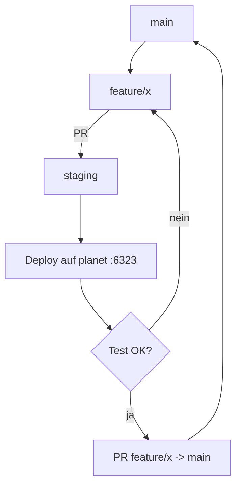

# STAGING — pre-main Umgebung (3. Dev-Server, für matheo)

Status: **Konzept** (noch nicht implementiert). Ziel ist eine dritte, persistente
Umgebung neben `dev`/`prod`: ein „pre-main"-Staging, auf dem matheo (bzw.
sein Agent) mit Feature-Branches arbeitet, testet und am Ende gegen `main` PRs
stellt. Diese Datei ist zugleich das **Handoff-Dokument** für matheos Agent.

> **Hardware-Befund (2026-09-16):** Der angebotene Server `65.21.253.64`
> („sync", Ubuntu 18.04) hat **1 vCPU · 1,9 GiB · 19 GB** und läuft schon
> `syncthing` (Load 2.0) — **zu klein** für den Dedicated-Server (Minimum laut
> `docs/SERVER_SIZING.md`: 2 vCPU · 4 GiB · 30 GB; der Server idlet bei ~1,5
> Cores / ~1,4 GiB). Deshalb: **Staging läuft ko-lokiert auf `planet`** (20
> vCPU / 62 GiB, Luft vorhanden), und die Sync-Kiste wird als **Relay** genutzt
> (eigene IPv4 = öffentlicher 6321-Einstieg), exakt wie der bestehende
> `satellite`.

---

## 1. Ziel

- Ein **dritter Twin auf `planet`** (wie `prod`) mit dem kompletten Stack:
  Dedicated-Server, Tournament/Referee, Server-Control („Plane B"), Web-UI/Caddy,
  Session-Recorder, Crash-Collector.
- Eine eigene Domain `*.staging.projectmellon.de` (Landing + Cockpit).
- Ein langlebiger `staging`-Branch als „pre-main": Feature-Branches werden dort
  integriert und getestet, **bevor** sie als Feature-Branch-PR auf `main` gehen.
- `staging` ist **generisch** benannt (nicht „matheo") — später erweiterbar auf
  `staging-01`, `staging-02`, …

---

## 2. Branch-Modell



- **`main`** = ship-fähig (rollt `dev` aus, `v*`-Tag rollt `prod`).
- **`staging`** = long-lived Integrations-Branch („pre-main"), periodisch mit
  `main` synchronisiert (Reset/Rebase), damit er nicht driftet.
- **Feature-Branches** werden von `main` abgezweigt, nach `staging` ge-PR-t,
  dort getestet, und bei Erfolg **als Feature-Branch** nach `main` ge-PR-t.

Wichtig (explizit so gewollt): **`staging` wird NICHT nach `main` gemergt.**
Promoviert wird der einzelne **Feature-Branch** (`feature/x` → `main`), nachdem
er auf `staging` grün war. `staging` selbst ist nur die Test-/Integrationsfläche.

Synchronisation: `staging` regelmäßig auf `main` zurücksetzen (z. B. nach jedem
Release oder wöchentlich), dann die noch offenen Features erneut darauf mergen.

---

## 3. Topologie

Staging ko-lokiert auf `planet` als dritter Twin (dev/prod sind schon dort).
Der öffentliche 6321-Einstieg läuft über die Sync-Kiste als **Relay**
(`sync:6321 → planet:6323`), identisch zum prod-Muster (`satellite:6321 →
planet:6322`).

|                   | `dev`                          | `prod`                        | **`staging` (neu)**                  |
| ----------------- | ------------------------------ | ----------------------------- | ------------------------------------ |
| Trigger           | push `main`                    | push Tag `v*`                 | **push `staging`**                   |
| Host (Game-Stack) | planet                         | planet                        | **planet**                           |
| Game-Port         | 6321                           | 6322                          | **6323**                             |
| Öffentlich via    | 65.21.27.234:6321              | satellite:6321 → :6322        | **sync (65.21.253.64):6321 → :6323** |
| IO-Bridge         | 9001                           | 9002                          | **9003**                             |
| Tournament        | 8081                           | 8082                          | **8083**                             |
| Server-Control    | 8092                           | 8093                          | **8094**                             |
| rift-caddy        | 8787                           | 8788                          | **8789**                             |
| Landing           | www.drift.projectmellon.de     | www.rift.projectmellon.de     | **www.staging.projectmellon.de**     |
| Cockpit           | cockpit.drift.projectmellon.de | cockpit.rift.projectmellon.de | **cockpit.staging.projectmellon.de** |

Pfade/Volumes kommen automatisch aus `rift_env=staging`
(`/srv/rift-staging/…`, Compose-Projekt `riftbreaker-dedicated-staging`,
Volumes `rb-wine-staging`/`rb-saves-staging`). Die Web-UI terminiert der
bestehende `mellon-caddy` (proxyt `*.staging.projectmellon.de` →
`127.0.0.1:8789`), DNS host-seitig bei Cloudflare — **kein** eigenes
Caddy/TLS-Setup nötig.

---

## 4. Full-Stack (Rollen)

Identisch zu `deploy-prod.yml`:

```text
mods-zip → dedicated-server-image → game-content → rbtools
→ riftbreaker-server → tournament-server → server-control (Plane B)
→ website → crash-collector        [Play 1: planet]
+ satellite-relay                  [Play 2: sync, DNAT 6321 → planet:6323]
```

`image-retention`/`host-hygiene` bleiben planet-weit (ein Timer je Host, kein
Env-Zwilling).

---

## 5. Env-Isolation / Identity

Staging folgt dem **prod-Muster** (Override-Datei, gleicher Host), nicht dem
früher erwogenen „eigener Host"-Ansatz:

- `rift_env=staging` als Play-Var in `deploy-staging.yml`.
- Override-Datei `deploy/staging-vars.yml` = Klon von `deploy/prod-vars.yml`
  (alle `-prod`-Namen/Ports/Domains auf `-staging` umbenannt, Ports 6323/9003/
  8083/8094/8789, Domains `*.staging.projectmellon.de`).
- `rift_env`-Allowlist in `deploy/tasks/deploy-identity.yml` heute hart
  `['dev','prod','test']` → um `staging` erweitern.
- `deploy/env-schema.yml`: `staging` in dieselben `per_env`-Listen wie `prod`
  aufnehmen (Container-/Port-/Pfad-/Domain-Vars).

Secrets: Staging-eigenes Server-Passwort + `server_control_token` in
`deploy/inventory/host_vars/planet/vault.yml` (neue Keys, z. B.
`vault_server_control_staging_token`), **nicht** aus dev/prod wiederverwenden.

---

## 6. Deploy-Mechanik

**CD (analog prod), weil Staging auf planet liegt** — derselbe `ssh rbd`
-forced-command-Weg:

```text
push auf staging → deploy-staging-Job (Runner planet)
  → ssh rbd "<sha> refs/heads/staging"
  → forced command: refs/heads/staging → env=staging
  → Wrapper: deploy-staging.yml -e @deploy/staging-vars.yml
       Play 1: planet (Staging-Stack)
       Play 2: sync   (satellite-relay, 6321 → planet:6323)
```

Der Wrapper läuft als root auf planet; für Play 2 braucht planet SSH auf `sync`
(`ansible_user: root`, Key in der Inventory/ssh-config) — gleiches Muster wie
der bestehende `satellite`-Zugang.

**Fallback/Handoff:** manuell per
`ansible-playbook -i deploy/inventory deploy/deploy-staging.yml -e @deploy/staging-vars.yml --ask-vault-pass`
(vom planet oder einem Rechner mit SSH auf planet + sync).

---

## 7. Konkrete Änderungen (Checkliste)

| #   | Datei                                         | Änderung                                                                                                                                                          |
| --- | --------------------------------------------- | ----------------------------------------------------------------------------------------------------------------------------------------------------------------- |
| 1   | `deploy/deploy-staging.yml`                   | **neu** — Klon von `deploy-prod.yml`: Play 1 `hosts: planet`, `rift_env: staging`; Play 2 `hosts: sync` (Relay), `satellite_relay_target_port: 6323` als Play-Var |
| 2   | `deploy/staging-vars.yml`                     | **neu** — Klon von `prod-vars.yml` (staging-Namen/Ports/Domains)                                                                                                  |
| 3   | `deploy/inventory/hosts.yml`                  | Host `sync` (`ansible_host 65.21.253.64`) ergänzen                                                                                                                |
| 4   | `deploy/inventory/host_vars/planet/vault.yml` | `vault_server_control_staging_token` + Staging-Passwort ergänzen                                                                                                  |
| 5   | `deploy/tasks/deploy-identity.yml`            | `rift_env`-Allowlist um `staging` erweitern                                                                                                                       |
| 6   | `deploy/env-schema.yml`                       | `staging` in die `per_env`-Listen (wie `prod`) aufnehmen                                                                                                          |
| 7   | `deploy/deploy-ssh.sh`                        | `refs/heads/staging → env=staging`                                                                                                                                |
| 8   | `deploy/deploy-wrapper.sh`                    | env-Case + Dispatch `refs/heads/staging → deploy-staging.yml -e @deploy/staging-vars.yml`                                                                         |
| 9   | `.github/workflows/deploy.yml`                | Job `deploy-staging` (push `staging`)                                                                                                                             |
| 10  | `deploy/roles/satellite-relay/`               | **keine Änderung nötig** — Ziel-Port kommt als Play-Var (`satellite_relay_target_port`), kein `host_vars/sync`                                                    |

---

## 8. Setup (einmalig)

1. **DNS (Cloudflare, host-seitig):** A-Records `staging` / `www.staging` /
   `cockpit.staging.projectmellon.de` → `65.21.27.234` (planet).
2. **`mellon-caddy`:** zwei Einträge für die Staging-Domains → `127.0.0.1:8789`
   (die `website`-Rolle schreibt sie, wie für prod).
3. **Sync-Kiste (Relay):** `deploy-staging.yml` Play 2 installiert die
   `satellite-relay`-Rolle auf `sync` (iptables-DNAT 6321 → planet:6323,
   reboot-fest). Benötigt nur: planet→`sync` SSH-Zugang (root, Key).
4. **Vault:** Staging-Passwort + Token in `host_vars/planet/vault.yml`.
5. **Branches:** `staging` anlegen (von `main`), ggf. Branch-Protection.

---

## 9. Handoff an matheos Agent

**Voraussetzung:** SSH auf planet (+ sync für Relay) und/oder die CD läuft.

**Workflow pro Feature:**

```bash
# 1. Ausgangspunkt: main (nicht staging)
git checkout main && git pull
git checkout -b feature/<kürzel>

# 2. Arbeiten, committen, pushen
git push -u origin feature/<kürzel>

# 3. Auf staging integrieren (PR feature/x -> staging, oder direkter Merge)
git checkout staging && git pull && git merge feature/<kürzel> && git push origin staging

# 4. Deployen (CD macht das bei push auf staging automatisch; manuell als Fallback:)
ansible-playbook -i deploy/inventory deploy/deploy-staging.yml \
  -e @deploy/staging-vars.yml --ask-vault-pass

# 5. Testen
#    Spiel:    65.21.253.64:6321   (sync-Relay → planet:6323)
#    Cockpit:  https://cockpit.staging.projectmellon.de/contract/
#    Landing:  https://www.staging.projectmellon.de/
#    Logs:     ssh planet docker logs riftbreaker-dedicated-staging

# 6. Bei Erfolg: Feature-Branch nach main (NICHT staging nach main)
#    GitHub: PR "feature/x" gegen "main" (Closes #N)
```

**Regeln (für den Agent):**

- Nie `staging` nach `main` mergen. Promoviert wird der **Feature-Branch**.
- `staging` regelmäßig auf `main` zurücksetzen (Reset), nicht Feature-Müll
  anreichern.
- Ein Issue pro Arbeit (Repo-Regel: `!claim`, `feature/…`-Branch, PR mit
  `Closes #N`), auch wenn der erste Merge nach `staging` geht.
- `rift_env=staging` muss in der Identity sichtbar sein
  (`docker inspect … RBB_ENV=staging`) — Verifikation vor dem Test.

---

## 10. Offene Punkte / Entscheidungen

1. **Relay-Ziel-Port pro Env** (gelöst) — `satellite_relay_target_port: 6323`
   kommt als **Play-Var** aus `deploy-staging.yml` (Play 2); kein
   `host_vars/sync/` und keine Rollen-Generalisierung nötig (die Rolle liest die
   Var bereits, Default bleibt prod `:6322`).
2. **Blast-Radius:** Staging teilt sich planet mit dev/prod (CD-Restart,
   Ressourcen). Für ein Test-/Staging-Env akzeptabel; echte Duelle gehören
   weiterhin nach prod.
3. **Auto-CD** — standardmäßig an (push `staging`), manueller Deploy als Fallback.
4. **Secrets** — Staging-eigenes Passwort + Token (eigener Vault-Key).
5. **DNS/TLS host-seitig** — Cloudflare-Records für `*.staging.projectmellon.de`
   (nicht repo-owned), `mellon-caddy`-Einträge über die `website`-Rolle.
