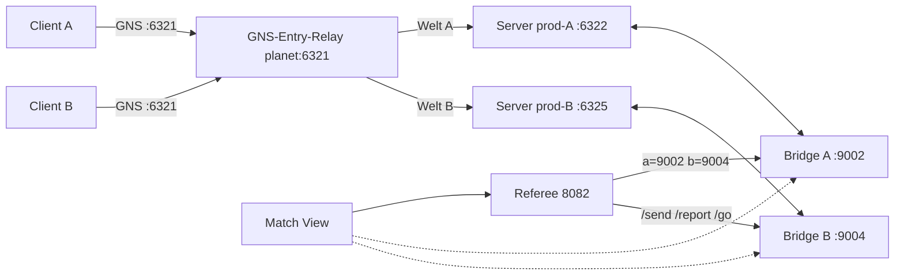

# VS-Match „Welt A / Welt B" — Routing · Infra · Game-Konzept

**Status:** Entwurf (Design) · **Stand:** 2026-09-23 · **Issue:** #875
**Refs:** Match-View-Entwurf (Issue #873 / PR #874, `docs/MATCH_VIEW.md` — noch offen), [`GAME_FLOW.md`](GAME_FLOW.md),
[`TOURNAMENT_API.md`](TOURNAMENT_API.md), [`SERVER_SIZING.md`](SERVER_SIZING.md),
[`tools/gns-proxy/README.md`](../tools/gns-proxy/README.md),
[`deploy/env-schema.yml`](../deploy/env-schema.yml).

## 0. Kurzfassung

Ein VS-Match braucht **zwei Welten = zwei Dedicated-Server**, hinter **einem**
öffentlichen Einstieg (der GNS-Proxy, weil der Client hart auf `IPv4:6321` steht).
Rollenbild: **DEV + STAGING = SOLO**, **PROD = VS** (Instanzen **A** und **B**).

**Harter Blocker:** Der GNS-Relay **bedient heute einen Client zur Zeit**
(`tools/gns-proxy/README.md`, „Grenze"). Zwei Spieler gleichzeitig brauchen
**mehrere Sessions im Relay** — das ist die erste Voraussetzung, alles andere
baut darauf auf.

## 1. Zielbild

| Env      | Rolle                              | Instanzen                          |
| -------- | ---------------------------------- | ---------------------------------- |
| dev      | SOLO (Persona emuliert den Gegner) | 1 (`:6324`)                        |
| staging  | SOLO                               | 1 (`:6323`)                        |
| **prod** | **VS**                             | **A (`:6322`) + B (neu, `:6325`)** |

Der **Einstieg ist immer `planet:6321/udp`** (Relay-Singleton). Die Zuordnung
Spieler → Welt passiert im Relay (heute Operator-Pin / Namens-Suffix).

## 2. Ist-Topologie (planet)

| Komponente           | dev                                        | staging | prod (A) |
| -------------------- | ------------------------------------------ | ------- | -------- |
| Game UDP (Host)      | 6324                                       | 6323    | 6322     |
| IO-Bridge            | 9001                                       | 9003    | 9002     |
| Referee (Tournament) | 8081                                       | 8083    | 8082     |
| Server-Control-Agent | 8092                                       | 8094    | 8093     |
| Rift-Caddy           | 8787                                       | …       | 8788     |
| GNS-Relay            | **6321 (Singleton, `network_mode: host`)** |         |          |

- Routing-Regel (`deploy/roles/gns-relay/templates/routes.j2`): `*-dev`→6324,
  `*-staging`→6323, `*`→6322. Auflösung: **exakt > längster Suffix > Default**.
- Operator-UI: `proxy.rift.projectmellon.de` (Host-Caddy → `127.0.0.1:9200`,
  basic_auth); Hold ist **an** (`gns_relay_hold: true`).
- prod-Referee zeigt heute **A==B** (`tournament_bridge_b_url == _a_url == 9002`).

## 3. Ziel-Topologie

### Portplan (neu = B)

| Zweck          | dev  | staging | prod-A | **prod-B (neu)**                      |
| -------------- | ---- | ------- | ------ | ------------------------------------- |
| Game UDP       | 6324 | 6323    | 6322   | **6325**                              |
| IO-Bridge      | 9001 | 9003    | 9002   | **9004**                              |
| Referee        | 8081 | 8083    | 8082   | — (**eine** Instanz, `bridge_b`→9004) |
| Server-Control | 8092 | 8094    | 8093   | **8095**                              |
| Rift-Caddy     | 8787 | —       | 8788   | — (kein eigener; prod-Caddy genügt)   |

## 4. Routing (GNS-Proxy)

### 4.1 Wie es heute routet

Pro Verbindung: **Operator-Pin (pro Identität)** > exakte Regel > `--hold`
(warten) > Default. Der Name steht erst **nach** dem Handshake im Klartext →
Re-Route mit Replay (kein Reconnect). Pins sind **in-memory**, Routen-Datei wird
beim Start gelesen.

### 4.2 Optionen für A/B

| Option                     | Wie                                                                              | Automatik            | Aufwand                         | Grenze                                                              |
| -------------------------- | -------------------------------------------------------------------------------- | -------------------- | ------------------------------- | ------------------------------------------------------------------- |
| **A** Operator-Pin         | neuer UI-Button `PROD_B=…:6325`, Hold an; Operator pinnt Spieler                 | nein (manuell)       | **kein Code**                   | nur bei 1 Session                                                   |
| **B** Suffix `*-a` / `*-b` | 2 Regeln in `routes.j2` + Rollen-Vars                                            | ja (Namensdisziplin) | klein                           | Default-Frage (`*`→?), Spieler müssten `-a/-b` heißen               |
| **C** Lobby-Mapping        | Referee/Lobby kennt Team A/B → setzt **Name/Identität→Ziel** über eine Relay-API | ja                   | mittel (API + evtl. Persistenz) | braucht die API (heute nur „wartende Session per Identität pinnen") |

### 4.3 Voraussetzung: Multi-Session

Alle Optionen scheitern am **Ein-Session-Limit**. Für VS zuerst:
**Relay: mehrere parallele Sessions** (Backpressure/Historie sind pro Client
bereits gedacht, `gns-probe`-README „Backpressure").

### 4.4 Empfehlung

- **Phase 1 (sofort testbar):** Option **A** (nur ein Target/Button) auf **prod-A**
  gegen eine **einzelne** Client-Session — validiert End-to-End, dass A hinter dem
  Relay ein Match fährt.
- **Phase 2 (VS-fähig):** **Multi-Session** + **Option C** (Lobby-getrieben), mit
  **Option B** (`*-a`/`*-b`) als pragischem Zwischenschritt/Fallback.

### 4.5 Betriebsrisiken (belegt)

- **Abgebrochenes Match nimmt dem Backend den `6321`-Listener** (Socket auf
  ephemerem Port) → Diagnose via `--dial`.
- **Backpressure:** Weltzustände ~500 KiB/Nachricht → Queues + 8 MiB Sendepuffer
  (implementiert); nicht anfassen ohne Bedarf.
- Nur **eine öffentliche IPv4** → A/B **muss** über Suffix/Pin laufen, DNS/Ports
  helfen nicht.

## 5. Infra: zweiter prod-Server (B)

### 5.1 Was B konkret braucht (Muster = prod-Twin, Issue #483)

- **Container/Ports:** `riftbreaker-dedicated-prod-b` @ `6325/udp`,
  Bridge `9004`, Agent-Unit `server-control-prod-b` @ `8095`.
- **Compose-Projekt** explizit (`riftbreaker-dedicated-prod-b`), **eigene Volumes**
  (`rb-wine-prod-b`, `rb-saves-prod-b`).
- **Pfade (Schema `<env>`):** `/srv/rift-prod-b/{game,backups,sessions}`,
  `/opt/rbmods/compose/rift-prod-b/riftbreaker`, `/opt/rbmods/rbtools/prod-b`.
- **Sidecars:** `riftbreaker-sessions-prod-b`, `-send-tailer-prod-b`,
  `-match-loop-prod-b`, `-attack-cycle-prod-b`.
- **Content:** per Sync aus dem kanonischen Cache (wie alle Envs).
- **Kein** eigener Caddy/Landing; die prod-Caddy (`:8788`) reicht.

### 5.2 env-schema & Deploy

- `deploy/env-schema.yml`: `prod-b` als **neue Env** in die `per_env`-Listen
  aufnehmen (sonst greift das Env-Isolations-Gate nicht / erbt still).
- Neue `deploy/prod-b-vars.yml` (Klon von `prod-vars.yml` mit `-prod-b`-Werten);
  `deploy-prod.yml` deployt **A und B** (zwei Plays). Tag-CD (`v*` → prod) bleibt
  der Einstieg.

### 5.3 Referee

**Eine** Referee-Instanz für das Match: `tournament_bridge_a_url=:9002`,
**`tournament_bridge_b_url=:9004`** (heute A==B). Damit kennt der eine Referee
beide Welten.

### 5.4 Sizing

`SERVER_SIZING.md`: **1v1-Prod (2 Instanzen + Referee + Website) = 4 vCPU/8 GiB**.
planet fährt heute **dev+staging+prod+test** (+ CD-Builds). Eine **weitere**
Dauer-Instanz heißt: **+~1,5 Cores / +~1,5 GiB idle** prüfen/ggf. aufstocken.
Empfehlung: `test` außerhalb der Match-Zeiten stoppen oder Host-Upgrade messen.

## 6. Game-Konzept VS

### 6.1 Referee = VS-Gehirn

Der Referee modelliert A/B bereits (Teams, `Mode::{Duel,Sp}`, `/lobby`, `/ready`,
`/go`, `/send`, `/report`, `/wave`, `/state` mit `winner`). Ziel: beide Bridges
(`a`/`b`) anbinden und den **SP-Mirror** durch echte Welten ersetzen.

### 6.2 Attack-Cycle je Welt

Je Server eine Sidecar-Instanz (heute bereits 1/Instanz) → **A und B haben
je einen eigenen Zyklus** (Natural + gekaufte Wellen). Der SOLO-Persona-Pfad
bleibt für dev/staging.

### 6.3 Cross-World-Sends (A→B)

Heute: `send_enemy` ist ein **Zähler** (`attack_cycle.enemy_outgoing`), der
Referee-`/send`-Endpoint ist da, hat aber **keinen Producer**. Zielpfad:
A-Sidecar erkennt „gekauft für den Gegner" → `POST /send {from:A,…}` an den
Referee → Referee legt es in B's `pending`-Queue → **Ingress in Welt B** (neue
Route an B's Bridge, z. B. `POST /incoming_send`) → B feuert via
`activate_mission_flow`. Der Referee-`reveal` (built/incoming) zeigt es der UI.

### 6.4 Sieger / Match-Ende

Heute: `report hq_hp` (extern) entscheidet `winner`; nativer HQ-Read existiert nur
single-world im `match-loop`. Ziel: **per-Welt-HQ-Reporter** (je Welt
`get_state.hq_hp` → `POST /report {world, hq_hp}`) → Referee setzt bei `hp<=0`
`winner = opponent`.

### 6.5 Gemeinsamer Start/Ready + Pause

- `ready` je Team aggregieren → bei „beide bereit" **Broadcast** (`start_epoch`)
  an **beide** Bridges → beide `PAUSED→WARMUP` (Warmup-Uhr je Server lokal, Drift ok).
- **Pause:** Fan-out `POST /pause_dom` / `/resume_dom` (#871) an **beide**
  Bridges; **offen:** den attack-cycle je Welt mitpausieren (eigene Timer).

### 6.6 Events pro Welt

Referee-`LogEntry` hat **kein `world`-Feld`** → ergänzen + fehlende Kinds
(`attack_fire`, `creature_event`, `map_reset`). UI pollt `/state` (+
`/events?since=`). Die Bridge-SSE bleibt raus (Single-Client).

## 7. Gap-Liste → abgeleitete Issues

| #   | Lücke                                                          | Blockiert    |
| --- | -------------------------------------------------------------- | ------------ |
| G1  | **Relay Multi-Session** (parallele Clients)                    | **alles**    |
| G2  | Relay-API **Name/Identität→Ziel** (Lobby) oder Suffix `*-a/-b` | Routing      |
| G3  | **prod-B Infra** (Vars/Ports/Container/Deploy/env-schema)      | Setups       |
| G4  | Referee: `bridge_b`→9004, **Aggregat-Ready/Go**, World-Tagging | Start/Sieger |
| G5  | **Cross-World-Send-Pfad** (A-Egress → Referee → B-Ingress)     | Gameplay     |
| G6  | **per-Welt-HQ-Reporter** → Referee (Sieger)                    | Match-Ende   |
| G7  | **Pause-Fan-out** (beide) + Sidecar mitpausieren               | Betrieb      |
| G8  | **Match-View-UI** (konsumiert G1–G7)                           | UX           |

## 8. Phasenplan

0. **G1** Relay Multi-Session (Blocker).
1. **G3** prod-B Infra + **G4** Referee `bridge_b`.
2. **G2** Routing A/B (Lobby/Suffix) — Ende-zu-Ende: zwei Clients in zwei Welten.
3. **G5** Cross-World-Sends + **G6** per-Welt-HQ → Winner.
4. **G7** Start/Ready-Aggregat + Pause-Fan-out.
5. **G8** Match-View-UI.

## 9. Risiken & offene Entscheidungen

- **Relay-Ein-Session** ist der harte Blocker (G1) — vor allem anderen.
- **Sizing:** planet muss eine weitere Dauer-Instanz tragen (messen/aufstocken).
- **Name vs. Identität:** Suffix-Routing erzwingt Namensdisziplin; Lobby-Mapping
  ist sauberer, braucht aber die Relay-API (+ evtl. Persistenz der Pins).
- **Legacy:** Der Referee-`/go`-Command ist nicht mehr ausführbar; `TOURNAMENT_API.md`
  driftet → im Zuge von G4 geradeziehen.
- **Scope:** echtes 1v1 ist laut `PLAYTEST_1.0.md` **Post-1.0** — dieses Konzept
  ist die Vorarbeit dafür.
