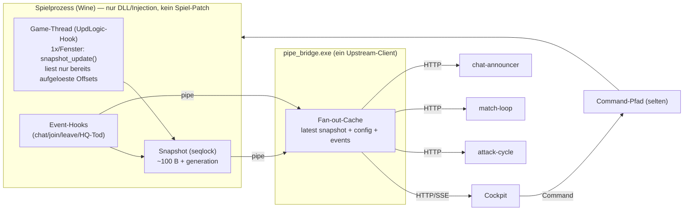

# RFC 0001 — Dedicated-IO: Zustands-Pipeline (Snapshot-Push + Fan-out) statt Scan-Polling

- **Status:** Entwurf / zur Diskussion
- **Kontext-Issues:** Observability-/Perf-Befund aus dem Live-Match `mctoastus` (prod, 2026-10-01, ~09:41–09:48 UTC)
- **Betroffen:** `server/dll/rbbridge.c`, `server/pipe-bridge/pipe_bridge.c`, `deploy/*` (Konsumenten), Deployment-Topologie
- **Nicht betroffen:** Client/Spiel selbst (kein Eingriff), Mod-Lua soweit nicht unten erwähnt

> Dieses Dokument ist eine **Entscheidungsvorlage + Spikplan**. Es ändert keinen
> Produktionscode. Nach `AGENTS.md` gehört es als Deliverable an ein Issue; der
> „Spikes"-Abschnitt ist als Checkliste für Folge-Issues gedacht.

---

## 1. Problem (Ist-Stand, belegt)

Der Dedicated-IO-Pfad liest heute **durchgehend per Polling** und löst dabei pro
Anfrage **Instanzen über einen Full-Process-Heap-Scan** auf. Das ist im Hot-Path
teuer und skaliert mit der Anzahl der Konsumenten.

**Belege (prod, 2026-10-01):**

- `get_state` scannt **pro Aufruf** den gesamten Prozess nach der
  PlayerService-vftable: `scan_qword_instance(base + 0x2e8e910, "get_state")`
  (`server/dll/rbbridge.c:6180`).
- Mit Spieler im Server kommen **zwei weitere** Volscans dazu:
  `resolve_hq_find` + `resolve_hq_health` (`rbbridge.c:6033`, Kommentar „**kein
  Cache**").
- `scan_qword_instance` (`rbbridge.c:4072`) iteriert **alle lesbaren Regionen**
  (~500) und kopiert jede per `ReadProcessMemory`.
- Messung: **vor** Join = 1 Scan/Poll, **nach** Join = **3 Scans/Poll**; Takt
  ~50 Polls/min ⇒ ~150 Volscans/min.
- **Mehrere Poller parallel**, jeder unabhängig:
  - Cockpit Operator-Tab: `get_state` **1 Hz** (`cockpit/cockpit.html:2642`),
  - `attack-cycle`: Main-Loop **1 Hz**, `step()` pollt `get_state` in RUNNING
    (`deploy/attack-cycle/attack_cycle.py:1589`),
  - `match-loop`: **1 Hz** `get_state` (`deploy/match-loop/match_loop.py:268`).
- Zusätzlich feuert der `attack-cycle` **11 Endpunkte/s**, davon ~8 reine
  **Config**, die sich nur bei Cockpit-Schreibzugriff ändert (liegt in
  `pipe_bridge` längst als `g_*` im Cache).

**Hypothese:** Der Bridge-Scan-Aufwand (3 Volscans/Poll, mehrfach/s) trägt zur
Simulations-Dilation bei („eine Spielsekunde in 3"). **Nicht bewiesen** — es gibt
keine geloggte Server-Tick-Rate (Observability-Lücke, siehe §8).

Kernaussage: Das Problem ist **nicht** der Transport und **nicht** der
Rohwert-Read (Carbonium ist bereits ein direkter C++-Read,
`Riftbreaker::GetPlayerAccount`, `dedicated-io-direct-reads.md`), sondern die
**Instanz-Auflösung per Vollscan** und die **Frequenz**.

---

## 2. Ziel

1. **Ein** Produzent für Zustandsdaten, **viele** Leser (Fan-out) — Leser lösen
   keinen Scan mehr aus.
2. **Direkte Reads** über aufgelöste Pointer/Offsets; **kein Vollscan im
   Hot-Path**.
3. **Frequenz an den echten Bedarf** koppeln (Event vs. Snapshot vs. Command vs.
   Config).
4. **Solide Architektur, keine Shortcuts:** sauberes Kanal-Modell, klare
   Ownership, definierte Invalidierung, testbar.

**Nicht-Ziele (dieses RFC):** Client-/Spieländerungen; Wellen-/Balance-Logik;
Desync-Korrektur (nur die *Datenbasis* dafür, §6/S3).

---

## 3. Anforderungs-Inventar — „Was müssen wir wann wirklich wissen?"

Das ist die zentrale Frage. Vier Kategorien, jede mit eigener Aktualität:

- **E (Event / Push):** sofort, ereignisgetrieben. Tritt selten auf.
- **S (Snapshot):** niederfrequent (0,25–1 Hz), gleitender Zustand.
- **C (Config / Edge):** nur bei Änderung (Schreibzugriff).
- **K (Command / On-Demand):** nur im Moment der Aktion.

| Wert | Heute Quelle | Konsument(en) | Nötige Aktualität | Soll |
|---|---|---|---|---|
| Carbonium/Ironium + max (+ `resources[]`) | `get_state` (C++ direct) | Cockpit, `try_spend`-Affordability | Anzeige ~1 Hz; Afford nur beim Kauf | **S** + **K** |
| HQ `hp` / `hp_max` | `get_state` → `read_hq_health` | Cockpit | ~1 Hz | **S** |
| HQ `dead` (Tod) | `get_state` → `read_hq_health` | `match-loop`, `attack-cycle` (GAME_OVER) | **sofort** | **E** |
| `mission_flow` / `_active` / `_payload` | `get_state` | Cockpit | bei Flow-Wechsel | **E** (Wechsel) |
| `players` (`GetConnectedPlayers`) | `get_state` | Cockpit, Ready-Gate | bei Join/Leave | **E** + **S** |
| `pause_want` | Global (kein Scan) | Cockpit | ~1 Hz | **S** (billig) |
| `creatures_base_difficulty` | `get_state` | Cockpit | ~1 Hz | **S** |
| `end_game` result/status | Global (`g_end_result`) | Cockpit | bei Aufruf | **E** |
| Chat `player_chat` / `/ready` | `get_state`-Piggyback (Ring-Queue) | Cockpit, Ready-Gate | **sofort** | **E** (Push) — teils vorhanden |
| `attack_status` (Cycle-State/Orders) | `attack-cycle /status` | Cockpit | ~1 Hz | Cycle-intern (kein Bridge-Read) ✅ |
| `game_config` (+ `send_yourself`, `players`, `ready_*`) | Bridge-Cache `g_game_config` | Cockpit, `attack-cycle` | bei Änderung | **C** |
| `personas` | Bridge-Cache | Cockpit, `attack-cycle` | bei Änderung | **C** |
| `natural_attack_rules` | Bridge-Cache | Cockpit, `attack-cycle` | bei Änderung | **C** |
| `attack_interval` / `difficulty_interval` | Bridge-Cache | Cockpit, `attack-cycle` | bei Änderung | **C** |
| Kapseln (`/capsule/*`) | Capsule-Dienst | Cockpit Game-Config-Tab | 3 s | eigener Dienst (ok) |
| **Spiel-Tick / Game-Clock** | — (neu, RE) | Desync/Pause (später) | ~1 Hz | **S** |
| Wellen-Send / `end_game` / `restart_map` / `activate_flow` / `add_resource` | Commands | Cockpit, `send-tailer`, `match-loop`, Cycle | im Moment der Aktion | **K** (unverändert) |

**Ergebnis:** „Pro Tick" brauchen wir wirklich nur **wenige** Werte:
HQ-Tod (als **Event**), plus Ressourcen + HQ-hp + Players + Clock als
**1-Hz-Snapshot**. Alles andere ist **Event**, **Config-Edge** oder **Command**.

---

## 4. Zielarchitektur

### 4.1 Kanal-Modell (vier Kanäle statt „alles pollen")

1. **State-Snapshot (S):** ein Produzent (Game-Thread) schreibt ~1 Hz einen
   kleinen Snapshot; Leser lesen ihn **ohne Scan**.
2. **Events (E):** Push für seltene, sofortige Dinge (HQ-Tod, Join/Leave, Chat,
   Flow-Wechsel). Kein Polling.
3. **Config (C):** Bridge hält die kanonische Kopie (`g_*`) + `generation`;
   Konsumenten reagieren auf Änderung (ETag/`If-None-Match` oder SSE), nicht auf
   Zeit.
4. **Commands (K):** unverändert Command-Pfad; Affordability (`try_spend`) wird
   **im Moment** der Aktion geprüft — kein Dauerlesen nötig.

### 4.2 Snapshot-Publisher auf dem Game-Thread

Der Detour `gameplay_updlogic_hook` (`rbbridge.c:5671`) läuft bereits **auf dem
Game-Thread** (er macht dort den Chat-Broadcast, `send_chat`, #934). Er ist der
natürliche Ort für einen `snapshot_update()`:

- liest Ressourcen/HQ-hp/Players/Clock über **bereits aufgelöste** Pointer und
  Offsets (keine Suche),
- schreibt in einen kleinen, per **Seqlock** (oder `Interlocked`) geschützten
  Struct,
- Sampling auf ein Intervall begrenzen (z. B. 250 ms), nicht jeden Frame.

Vorteil: **keine** `ReadProcessMemory`-Bulk-Kopie, **keine** off-thread
Game-Calls mehr im HTTP-Pfad — der Pipe-Thread liest nur noch den fertigen
Snapshot.

### 4.3 Instanz-/Pointer-Auflösung: Epoch + Re-Validierung (direct reads)

Vollscans entfallen, indem die Anbindung **einmal pro Welt-Epoch** aufgelöst und
dann **billig re-validiert** wird:

- **Bevorzugt — stabile Root-Pointer (RE):** ein Static/Global im Modul, der auf
  World/`PlayerService`/`HealthService`/`FindService` führt. Dann ist jeder Read
  ein **einzelner Deref** (Kette à la `Service[+8] = World*`, `World[+0x30] =
  ECS`, `HealthComponent[+0x00/0x04]` — siehe
  `docs/research/dedicated-io-direct-reads.md`).
- **Fallback — Scan nur beim Epoch-Start:** ein einziger Scan beim Weltaufbau,
  danach Validierung pro Nutzung über **einen** Read
  (`instance[0] == vftable`); schlägt sie fehl → Re-Resolve + Epoch-Bump.
- **Invalidierung:** bei `restart_map` / `end_game` / Readiness-Re-Gate
  (verwandt zu #479 „Readiness nur ohne Neustart gelatcht",
  `server/README.md`).

Ergebnis: Der **Hot-Path hat null Scans**; Scans sind reiner **Cold-Path**
(Weltaufbau/Recovery).

### 4.4 Fan-out in `pipe_bridge` (das „Layer dazwischen")

`pipe_bridge` ist schon der **einzige** Pipe-Client (nur ein Client pro Pipe,
`server/protocol.md`) und hält Config bereits gecacht. Es fehlt der
**State-Cache**:

- Ein **einziger** Hintergrund-Poller (oder besser: die DLL **pusht** alle
  Snapshot-Ticks) aktualisiert `latest_snapshot` + `events[]`.
- **Alle** HTTP-Leser bedienen sich aus dem Cache — **kein** Forward an die DLL
  pro Request.
- **Config:** `generation`-Zähler; Leser bekommen `ETag` oder einen
  SSE-Stream. Minimal: Konsumenten pollen Config bei 5–10 s statt 1 Hz.

Damit ist die Aussage „nur ein Polling aktiv, alle anderen lesen" erfüllt — und
zwar end-to-end (nicht nur HTTP-seitig).

### 4.5 Optional: SSE/WebSocket statt Poll

Für Cockpit-HUD und Cycle bietet sich ein **Server-Sent-Events**-Stream
(`GET /events`) an: Snapshot-Ticks + Events als Push. Dann fällt auch der
1-Hz-Cockpit-`get_state` weg. (Kann späterer Schritt sein; §7.)

---

## 5. Was sich konkret ändert (pro Endpoint/Konsument)

| Endpoint / Konsument | Heute | Soll |
|---|---|---|
| `POST /get_state` (Cockpit 1 Hz) | Forward → 3 Volscans | Cache-Read (Snapshot); optional SSE |
| `get_state` (match-loop 1 Hz) | Poll auf HQ-Tod | **Event** „HQ-Tod" (Push), kein Poll |
| `get_state` (attack-cycle, RUNNING) | Poll auf HQ-Tod | **Event** nutzen |
| `GET/POST game_config, personas, natural_attack_rules, *_interval` (Cycle 1 Hz) | 11 Endpunkte/s | **Config-Edge**: nur bei `generation`-Änderung |
| `attack_reset` / `round_reset` jede Sekunde | Poll zum Sync | entfernen / auf Aktion beschränken |
| Commands (`try_spend`, wave, `end_game`, `restart_map`) | on demand | unverändert |

---

## 6. Spikes (jeweils eigenes Issue, Ergebnis = RVA/Offset/Beweis)

- **S1 — Stabile Root-Pointer.** Statics/Globals für World/`PlayerService`/
  `HealthService`/`FindService` finden (PDB/`llvm-pdbutil` + `tools/re/disasm.py`).
  *Deliverable:* RVA + Pointer-Kette + Live-Beweis auf planet.
- **S2 — Game-Thread-Snapshot.** Ist `UpdateGameplayLogic` garantiert auf dem
  Game-Thread und mit stabiler Kadenz? Kosten/Sicherheit von Resource-/HQ-Reads
  dort messen. *Deliverable:* Messprotokoll + Crash-Freiheit.
- **S3 — Spiel-Tick/Clock.** Existiert ein Sim-Tick/Game-Clock (fixer Step?
  Delta)? *Deliverable:* RVA, Semantik, Read — Basis für spätere
  Desync-/Pause-Logik.
- **S4 — Event-Edges.** HQ-Tod, Player-Join/Leave als saubere Edges aus Hooks
  (Join ist im Game-Log sichtbar; Leave hat heute **keine** Signatur,
  `session_recorder.py`). *Deliverable:* Event pro Übergang.
- **S5 — Fan-out + Config-Generation.** Cache/ETag/SSE in `pipe_bridge`.
  *Deliverable:* HTTP-Lesen ohne DLL-Forward + Lastmessung.
- **S6 — Server-Tick-Observability.** Sim-Rate/Tick als geloggter/lesbarer Wert,
  damit Lag↔Last **korrelierbar** wird (heute unmöglich). Verbindet sich mit dem
  Crash/Observability-Befund.

---

## 7. Abnahme / Messgrößen

- Volscans im Hot-Path: **150/min → 0**.
- `get_state`-Kosten pro Request: **~200–300 ms Scan → ~µs (Cache-Read)**.
- `get_state`-Poller: **bis zu 3 → 0** (Push/SSE) bzw. 1 (Cache).
- Config-Requests: **~11/s → nur bei Änderung**.
- Kein neuer Crash/Korruptionspfad (Re-Validierung + Epoch- Regel getestet).
- **Korrelation:** S6 zeigt, ob Tick-Dilation mit der Last sinkt (Hypothese §1).

---

## 8. Deployment-Aufräumen (verwandtes, eigenes Issue)

Aktuell gibt es **drei Twins** auf planet (dev/prod/staging) plus A/B-Gaming und
einen GNS-Entry-Relay. Beobachtung: **staging ist kaputt/unbenutzt**
(`riftbreaker-dedicated-staging` → `CreateNamedPipeA GLE=231`-Loop, dauerhaft
`unhealthy`), und der öffentliche Einstieg läuft ohnehin **ausschließlich** über
den **einen** GNS-Relay (planet:6321, Suffix-Routing; DNAT-Relays sind mit
#846 retired).

Vorschlag zur Diskussion:

1. **staging abkündigen** und abbauen: `deploy/deploy-staging.yml`,
   `deploy/staging-vars.yml`, CD-Job (`push staging`), Inventory-/Vault-Keys,
   Ports 6323/9003/8083/8094/8789, Domains `*.staging.projectmellon.de`,
   laufenden Container stoppen. Referenz-Topologie: `docs/STAGING.md`.
2. **prod-only** weiterentwickeln (A/B-Welten + Proxy-/GNS-Eingang).
3. **dev**-Rolle klären (brauchen wir den `main`-Auto-Deploy noch?).
4. Einstieg vereinheitlichen (nur GNS-Relay), Cockpit über Caddy-Route.

> Offene Frage an den Operator: dev **behalten** (schnelle main-Iteration) oder
> ebenfalls abbauen?

---

## 9. Offene Fragen

1. Snapshot-Mechanik: Seqlock-Struct im DLL-Image vs. `ReadProcessMemory` im
   Pipe-Thread aus dem Game-Thread-Puffer? (Empfehlung: ersteres.)
2. Push-Kanal: SSE gleich mit oder erst HTTP-Cache (Stufe 0/1)?
3. API-Stabilität: `get_state`-Format bleibt kompatibel (additiv), damit
   Konsumenten in Etappen migrieren können?
4. Werden Roots (S1) gefunden, entfällt selbst der Cold-Path-Scan — Ziel ja/nein?
5. Deployment-Cleanup **vor** oder **parallel** zum Pipeline-Umbau?

---

## 10. Vorgeschlagene Stufen

- **Stufe 0 (Quick Win, klein):** Scan-Ergebnisse in `rbbridge.c` cachen
  (Epoch-gebunden + vftable-Re-Validierung): **3 Scans → 1**; Config-Poll im
  Cycle auf Änderung/5–10 s senken; Cockpit-`get_state` auf 2 s.
- **Stufe 1 (Architektur):** Fan-out-Cache in `pipe_bridge` + Game-Thread-
  Snapshot; Hot-Path = 0 Scans; Events für HQ-Tod.
- **Stufe 2 (RE/ideal):** stabile Root-Pointer (S1) + Game-Clock (S3) +
  SSE-Push; „nur lesen, selten senden".

Jede Stufe ist einzeln lieferbar und einzeln messbar.
